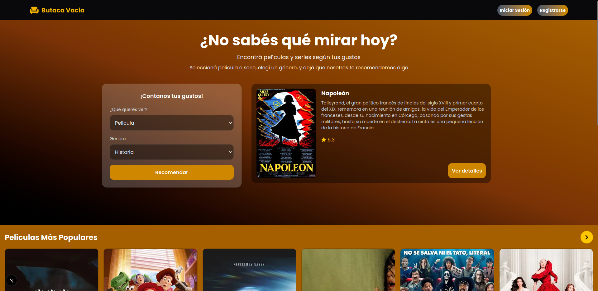
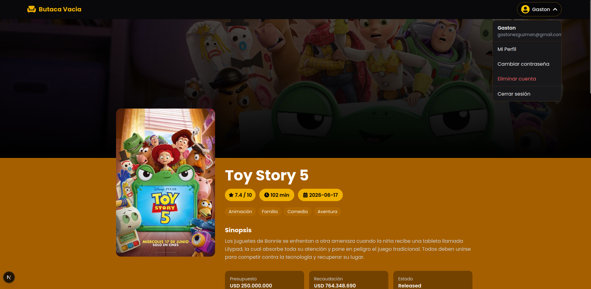
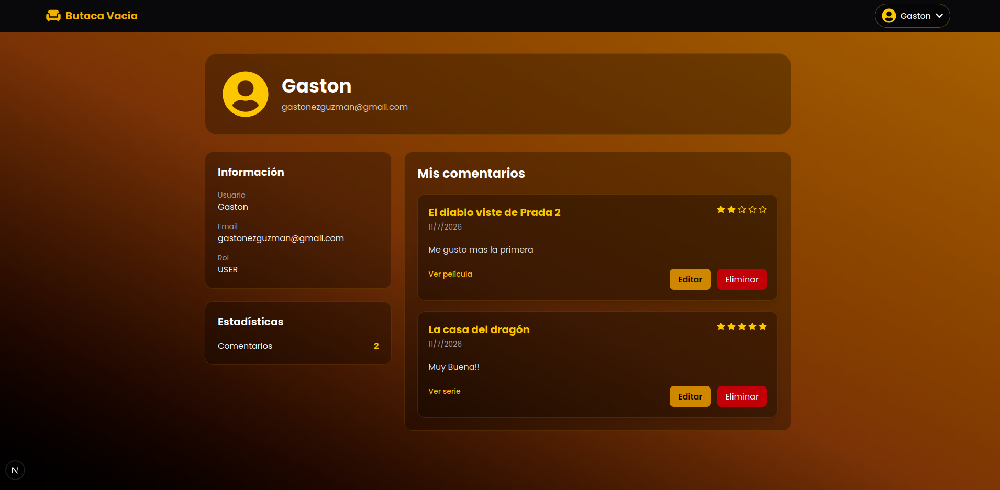

# Butaca Vacia - Frontend

Frontend desarrollado con **Next.js**, **TypeScript** y **Tailwind CSS** para una plataforma de recomendación de películas y series. Fue desplegado en Vercel.

La aplicación consume una API REST desarrollada en NestJS y permite explorar películas y series, consultar sus detalles, crear comentarios, administrar el perfil del usuario y recibir recomendaciones personalizadas.

Este proyecto fue desarrollado como parte de mi portfolio para demostrar conocimientos en desarrollo frontend moderno utilizando React, Next.js y buenas prácticas.

Para ver la **pagina** [ingrese aca](https://butaca-vacia.vercel.app/)

Para ver el **codigo del backend** [ingrese aca](https://github.com/Gastonguz3/butaca-vacia-backend)

## Tecnologías

- Next.js 
- React 
- TypeScript
- Tailwind CSS
- React Context API
- React Hot Toast
- React Icons


## Funcionalidades

- Registro e inicio de sesión.
- Autenticación persistente mediante Context API.
- Exploración de películas y series populares.
- Búsqueda de detalles completos y recomendaciones de películas y series.
- Sistema de comentarios y puntuaciones.
- Edición y eliminación de comentarios.
- Gestión del perfil del usuario.
- Cambio de contraseña y eliminación de cuenta.


## Autenticación

La autenticación se comunica con la API del backend mediante JWT.

La aplicación implementa:

- Inicio de sesión.
- Registro.
- Renovación automática del Access Token.
- Cierre de sesión.
- Protección de funcionalidades para usuarios autenticados.

Los usuarios autenticados pueden:

- publicar, editar y eliminar comentarios
- puntuar películas y series

## Instalación

### 1. Clonar el repositorio

```bash
git clone https://github.com/Gastonguz3/butaca-vacia-frontend
```

### 2. Instalar dependencias


```bash
pnpm install
```

### 3. Configurar variables de entorno

Crear un archivo `.env.local`

```env
NEXT_PUBLIC_NEST_API_URL=http://localhost:4000
```

### 4. Ejecutar el proyecto

```bash
pnpm dev
```

La aplicación estará disponible en:

```
http://localhost:3000
```

## Páginas principales

| Ruta | Descripción |
|:------|:------------|
| `/` | Página principal |
| `/login` | Inicio de sesión |
| `/register` | Registro |
| `/movie/:id` | Detalles de una película |
| `/series/:id` | Detalles de una serie |
| `/profile` | Perfil del usuario |

## Diseño

### Pantalla Principal 


### Pantalla de los detalles


### Pantalla del perfil


#### Autor: Gaston Guzman [linKedIn](https://www.linkedin.com/in/gaston-guzman-192730352/).